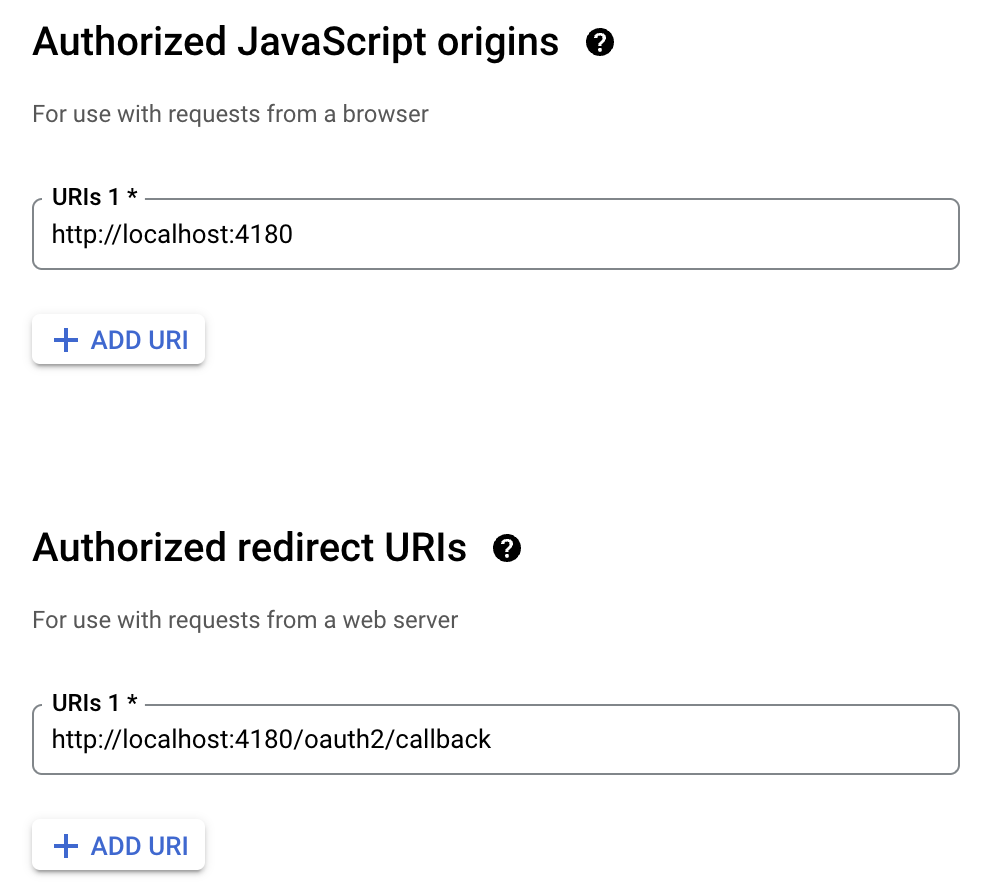
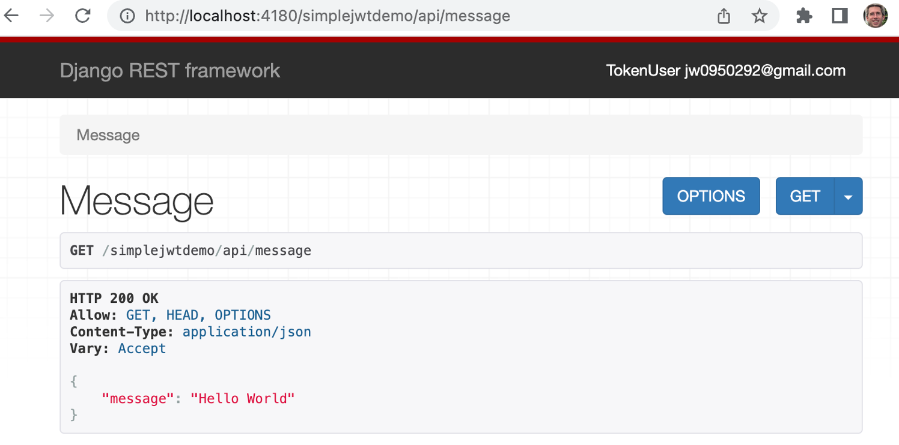
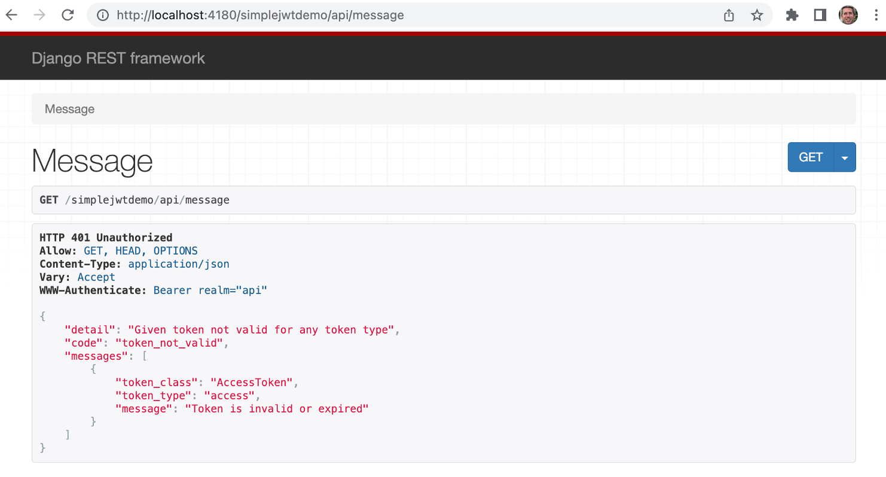

# Simple JWT Demo

This is a simple demo of a Django REST Framework backend using Google authentication
via [OAuth2 Proxy](https://github.com/oauth2-proxy/oauth2-proxy).

The Django REST Framework authentication is implemented using
[Simple JWT](https://github.com/jazzband/djangorestframework-simplejwt).

## Creating a Google OAuth2 app:

First you will need to create an OAuth2 application at
<https://console.cloud.google.com/apis/credentials>, as described here:
<https://support.google.com/cloud/answer/6158849?hl=en>

It is recommended that you do this using your primary Google account, but use a separate
Google account for testing the authentication.

You will need to authorize the URL which we will use to access the application via the
OAuth2 Proxy: `http://localhost:4180`  and the the callback URL:
`http://localhost:4180/oauth2/callback`



Once you have created the Google OAuth2 app, you can copy the
`oauth2-proxy-development.sh.sample` file to `oauth2-proxy-development.sh`
and populate the Client ID and Client Secret.

The `oauth2-proxy-development.sh` script will launch a Docker container running OAuth2 Proxy
which will listen for requests on port 4180 and proxy them to port 8000.

The Django application be run as follows:

```
$ python manage.py runserver
Starting development server at http://127.0.0.1:8000/
```


## Tests

Tests can be run using:

```
DJANGO_SETTINGS_MODULE=main.test_settings pytest --cov simplejwtdemo
```

The test settings contain a private key used for signing JSON Web Tokens (JWTs)
created for test cases, and a public key, used to verify the signature on those JWTs.

When using a real identity provider, our application doesn't need to know the private
signing key.  We just need a public key or certificate to verify the signature, which
we get from <https://www.googleapis.com/oauth2/v3/certs>


## The authenticated Django REST Framework endpoint

This API provides just one endpoint, returning a payload containing the string "Hello World"

If you attempt to access this endpoint via the OAuth2 Proxy (listening on port 4180), and you
don't already have an authentication token, you should be prompted to sign in with your Google
account, and then you should see the Django endpoint responding with your Google identity in
the top-right corner:




## Response when unauthorized:

Running OAuth2 Proxy in a local Docker container doesn't provide exactly the same experience
as running OAuth2 Proxy in a production-worthy reverse proxy / load balancer.  In production,
you can ensure that all incoming requests for your application get redirected via the OAuth2
Proxy, but when running locally, it is possible that you will get an unauthorized error due
to a stale authentication token, and you might need to remove your cookies and reload the page
to resolve it:




## WARNING - NOT SUITABLE FOR PRODUCTION

There are settings in `main/settings.py` including `DEBUG = True` which are not safe
to use in production.  Further work would be needed to fine-tune the settings to
make the application safe to run in production. See:
<https://docs.djangoproject.com/en/3.2/howto/deployment/checklist/>

Similarly, Django's built-in development server is not suitable for production use.
A production-grade web application stack should be used like NGINX / gunicorn or
Apache / mod_wsgi.
